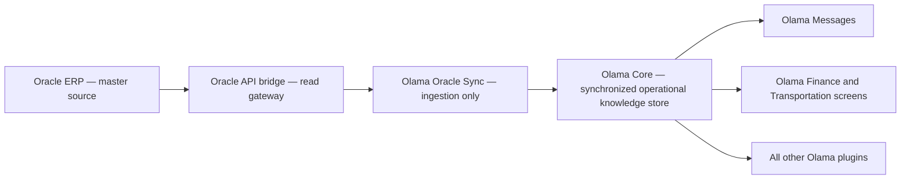

# Olama Core Offline Knowledge Architecture

**Reviewed:** 2026-07-15  
**Scope:** `D:\api`, Olama Core, Olama Oracle Sync, and confirmed Olama Messages consumers.

## 1. Recommendation

Adopt this architecture:

Oracle remains the authoritative master. Olama Core becomes the only runtime data source for Olama plugins. Data will be eventually consistent rather than live at every click, which is appropriate for this system if every screen shows freshness clearly and synchronization runs frequently enough.

Only Olama Oracle Sync should call the Oracle bridge. Consumer plugins should not hold Oracle credentials or call gateway endpoints directly.

### Table ownership rule

Every table named `wp_olama_core_*` belongs exclusively to the Olama Core plugin.

- Only Olama Core migrations may create or upgrade these tables.
- Olama Oracle Sync may write knowledge data only through public Olama Core service methods; it must not execute direct SQL against Core tables.
- All other Olama plugins receive read-only access through public Olama Core query services; they must not create, alter, insert, update or delete Core records.
- Plugin-specific operational data remains owned by its plugin, for example message campaigns and delivery queues remain `wp_olama_msg_*` tables.
- Deactivating or uninstalling a consumer plugin must never remove or modify an Olama Core table.

The table prefix communicates ownership: `olama_core_*` is Core-owned, `olama_msg_*` is Messages-owned, and `olama_oracle_sync_*` is Sync-owned operational history.

## 2. Current state

### Data already persisted correctly

| Core table | Real entity | Current role |
|---|---|---|
| `wp_olama_core_families` | Family | Local family identity and limited profile |
| `wp_olama_core_students` | Student | Local student identity and limited profile |
| `wp_olama_core_student_years` | Student enrollment by study year | School, class, section and yearly status |

These are real domain tables and should remain.

### Current gaps

- Family 360, family card, student card, financial card and transportation card still call Oracle directly.
- The existing Core family/student/year columns do not persist many fields already displayed by Core's detailed screens.
- Financial summaries, dues and ledger entries have no local Core tables.
- Olama Messages currently creates and populates `wp_olama_core_student_transportation` as a consumer-side cache. This violates the ownership rule. Its migration and data service must move to Olama Core, and Messages must become a read-only consumer. The schema also omits transportation fields used by Core, including group, dates, active state and amount.
- Olama Messages still calls Oracle directly for financial and transportation audiences and payment reports.
- Availability is sometimes inferred from whether a PHP function exists, which proves only that the plugin is active, not that Oracle is reachable.

## 3. API service-to-entity map

| API group | Business entity | Persist in Core? | Target |
|---|---|---:|---|
| `/api/families`, family card | Family profile | Yes | Extend `olama_core_families` |
| Student lists and student card | Student profile | Yes | Extend `olama_core_students` |
| Student academic current/history | Student enrollment year | Yes | Extend `olama_core_student_years` |
| Family financial summary/card | Official family financial state per year | Yes | New `olama_core_family_financial_years` |
| Family due allocations | Family installment schedule | Yes | New `olama_core_family_financial_dues` |
| Student financial transactions | Financial ledger entries | Yes | New `olama_core_financial_transactions` |
| Family/student transportation | Student transportation assignment per year | Yes | Core-owned `olama_core_student_transportation` |
| Messaging recipients | Query projection | No | Derive through a Core recipient service |
| Transportation options | Query projection | No | Select distinct values from Core enrollment/transportation data |
| Payment report | Report projection | No | Assemble from family, students, years, financial summary, dues and transactions |
| Family 360 / family card / student card | UI projection | No | Assemble through Core services |
| Student crosswalk | Identity/readiness projection | No new table now | Existing Oracle keys already exist in the three Core identity tables |
| Diagnostics and schema candidates | Operational diagnostics | No | Keep in API/Sync administration |
| Finance endpoint aliases | Alternate transport contracts | No | Choose one canonical sync contract |
| `/payments` | Unproven/empty entity | No | Do not model until Oracle provides a proven source |

This avoids one table per API endpoint. Tables represent stable business entities; cards, audiences and reports are derived views.

## 4. Existing tables to extend

Persist only fields already required by current Core views or confirmed consumers.

### `olama_core_families`

Keep existing identifiers and contact fields. Add the detailed family fields currently requested from the family-card API:

- father national number, email, nationality, job, workplace, work phone and employee flag;
- mother national number, email, nationality, job, workplace, work phone and employee flag;
- family home phone, building number and home number;
- family class ID/name, notes and explicit `is_active`;
- Oracle created/modified timestamps.

Do not duplicate `oracle_family_id` into another physical `family_number` column. Expose it as `family_number` in the Core service/UI while preserving the database column for compatibility.

### `olama_core_students`

Add fields already used by the student-card screen:

- birth date/place, nationality and email;
- master registration date and previous school/average;
- mother name;
- renewal flags/year/date/reason;
- health, social case, refugee/emigrant, religion and pass/fail fields;
- monthly income and Oracle created/modified timestamps.

Black-list information and refugee/emigrant information must remain separate fields. They should not be combined under one UI label. Sensitive student fields should be exposed only through capability-checked Core services.

### `olama_core_student_years`

Add the academic fields already displayed by Core:

- branch ID/name;
- renewed-student flag;
- system-respect/commitment value;
- absence count;
- final result;
- academic notes;
- Oracle created/modified timestamps.

## 5. Minimal new business tables

### 5.1 `wp_olama_core_family_financial_years`

One row per family and study year, sourced from Oracle `SCH_FIN_FAMILY_CARD`.

Recommended key: `(family_uid, study_year)`.

Core fields:

- family UID and family number;
- study year;
- opening debit/credit;
- year debit/credit;
- official balance;
- currency;
- source hash;
- Oracle/source modified time when available;
- `last_synced_at`, `created_at`, `updated_at`.

This table is required because Oracle defines the official balance from the family financial card. It must not be reconstructed solely from due allocations or student transactions.

### 5.2 `wp_olama_core_family_financial_dues`

One row per family installment/due item, sourced from `SCH_FAMILY_DUE_ALLOC`.

Core fields:

- family UID/number and study year;
- due date and percentage;
- due amount, paid amount, receipt-paid amount and remaining balance;
- derived due status (`open`, `partial`, `paid`);
- source hash and synchronization timestamps.

Oracle currently exposes no stable due ID. Therefore synchronize dues as a complete family-year scope: download the entire scope successfully, then replace that family's due rows inside one database transaction. Do not delete old rows before a complete response is validated.

### 5.3 `wp_olama_core_financial_transactions`

One row per Oracle student ledger entry, sourced from `SCH_FIN_STUDENT_CARD`.

Core fields:

- family UID/number, student UID/number and study year;
- serial ID and receipt ID;
- transaction date;
- title ID/type/description;
- debit and credit amounts;
- notes and transaction status;
- beginning-year flag;
- source hash and synchronization timestamps.

Receipts, last payment, student totals and payment reports should be derived from this table. Do not create separate receipt or payment-report tables initially.

Some Oracle ledger rows do not have a guaranteed unique serial/receipt key. Use complete family-year replacement after successfully retrieving all pages, or a staging-and-swap process. Do not perform unsafe partial deletion.

### 5.4 `wp_olama_core_student_transportation`

Promote the existing Messages-created table to exclusive Olama Core ownership and upgrade it into a real domain table. Remove its creation and mutation logic from Olama Messages after the Core migration safely adopts existing rows.

Recommended identity scope: student + study year + assignment scope.

Required fields:

- student UID, family UID, family/student numbers and study year;
- transportation group ID/name;
- route code/name;
- arrival/departure bus IDs, names and sequence values;
- from/to dates;
- active state;
- transportation amount;
- source hash, Oracle modified time and `last_synced_at`.

Class, section and student name should normally be joined from the student/year tables instead of duplicated. Distinct bus/route/filter options should be derived from this table.

## 6. Tables not recommended

Do not add tables for:

- Family 360 cards;
- family cards or student cards;
- messaging recipient lists;
- payment reports;
- transportation filter options;
- financial-summary API responses separate from the family financial-year table;
- receipts separate from ledger transactions at this stage;
- crosswalk results;
- API diagnostics;
- raw endpoint aliases;
- the currently unavailable payments endpoint.

These would duplicate data, create synchronization conflicts, or store presentation results instead of business facts.

Raw JSON may remain for troubleshooting, but it must not be the application source of truth.

## 7. Core service layer

All plugins should use Core services rather than direct SQL or Oracle HTTP calls. Core owns both reads and writes; Oracle Sync invokes Core import/upsert methods, while consumer plugins use query methods only. Add services similar to:

- `families()->get_by_number()` and `families()->get_360()`;
- `students()->get_by_numbers()` and `students()->get_card()`;
- `financial()->get_family_year()`, `get_dues()` and `get_transactions()`;
- `transportation()->get_family()` and `get_student()`;
- `recipients()->query()` for general, financial and transportation targeting;
- `freshness()->for_family()` and `for_domain()`.

Core responses should include:

- `data_source: local`;
- `last_synced_at` by domain;
- a freshness state such as `fresh`, `aging`, `stale`, or `never_synced`;
- the last synchronization error when appropriate.

Olama Messages should then remove its Oracle credentials/providers and query Core. Its campaign, queue, token and delivery tables remain correctly owned by the Messages plugin.

## 8. Online and offline behavior

With this architecture, even the online action should preserve Core as the single read path:

1. **Saved data:** immediately read from Olama Core.
2. **Refresh from Oracle:** ask Olama Oracle Sync to refresh the selected family and study year across relevant domains.
3. Persist the response into Core.
4. Render the result by reading Core again.
5. If refresh fails, continue showing the saved data with its last-sync timestamp.

No Core screen or consumer plugin should render a raw Oracle response directly. This prevents online and offline modes from producing different shapes or behavior.

Suggested UI wording:

- `البيانات المحفوظة — آخر مزامنة: …`
- `تحديث من Oracle`
- On failure: `تعذر الاتصال بـ Oracle. يتم عرض آخر بيانات محفوظة بتاريخ …`

## 9. Synchronization strategy

### Per-family refresh

A single-family refresh should synchronize, in order:

1. family profile;
2. students and selected academic year;
3. family financial summary;
4. dues;
5. financial transactions;
6. transportation assignments.

Each domain must commit independently. A transportation failure must not discard a successfully refreshed family profile. The UI should show freshness per domain.

### Scheduled synchronization

A reasonable starting policy after bulk feeds exist:

| Domain | Suggested frequency |
|---|---|
| Families, students and academic years | Every 1–4 hours, plus nightly full reconciliation |
| Financial summaries, dues and transactions | Every 15–30 minutes during operational hours |
| Transportation | Every 30–60 minutes, plus nightly full reconciliation |

These are starting values, not guarantees. Actual frequency should be adjusted after measuring Oracle/API load and sync duration.

Use Action Scheduler or a real server cron trigger. Do not depend solely on low-traffic WP-Cron if predictable freshness is required.

### Safe reconciliation

- Upsert stable family/student/year/summary records using their natural keys and source hashes.
- Replace unstable child collections (dues, ledger rows when keys are ambiguous, transportation assignments) only after a complete scope has been downloaded and validated.
- Mark missing active records inactive only after a successful full reconciliation; never infer deletion from a failed or partial run.
- Preserve the last successful local data when Oracle is unreachable.

## 10. Required Oracle bridge improvements

The current bridge can support an initial per-family implementation, but it is inefficient for frequent ecosystem-wide synchronization. The family and student bulk routes ignore the `limit`/`offset` values currently sent by Olama Sync, and finance/transportation are primarily exposed per family or as UI-oriented messaging projections.

Add canonical paginated sync feeds:

- families, including active and inactive state;
- students and student years by explicit study year;
- family financial-year summaries;
- family due allocations;
- financial transactions;
- student transportation assignments.

Every sync feed should return a consistent envelope with `items`, `limit`, `offset` or cursor, total/`has_more`, explicit `study_year`, and an `as_of` timestamp.

Where Oracle has reliable `DATE_MODIFIED` fields, add an `updated_since` filter. Financial sources without reliable modification timestamps can continue using full scoped replacement. Incremental sync should be introduced only when Oracle fields prove it is correct.

Do not use `/api/messaging/...` as an ingestion source. Messaging endpoints are consumer projections and should eventually be rebuilt in Core from canonical local data.

## 11. Recommended rollout

### Phase 1 — Complete the existing knowledge entities

- Extend family, student and student-year columns/importers.
- Make Family 360, family card and student card read Core only.
- Add exact family-number lookup and improve the directory.
- Display last synchronization timestamps.

### Phase 2 — Transportation

- Move transportation table ownership and migration to Core.
- Enrich its schema and add the Core transportation service/importer.
- Change Core and Messages transportation features to read Core.

### Phase 3 — Financial

- Add the three financial tables and safe scoped importers.
- Rebuild financial card, financial recipients and payment reports from Core.
- Remove Oracle calls and credentials from Olama Messages.

### Phase 4 — Scheduling and gateway efficiency

- Add canonical bulk feeds and real pagination to the API bridge.
- Add scheduled domain syncs, freshness thresholds and nightly reconciliation.
- Add incremental feeds only where Oracle modification fields are proven reliable.

## 12. Final assessment

The proposed eventual-consistency model is a strong fit for Olama. It trades click-time Oracle freshness for availability, predictable performance, unified data contracts and simpler consumer plugins. The trade is acceptable as long as freshness is visible, refresh failures never erase valid local data, and sync intervals are chosen based on measured load.

The minimal target is the existing three Core tables, four real additional domain tables, and a Core service layer. Everything else should be derived.
